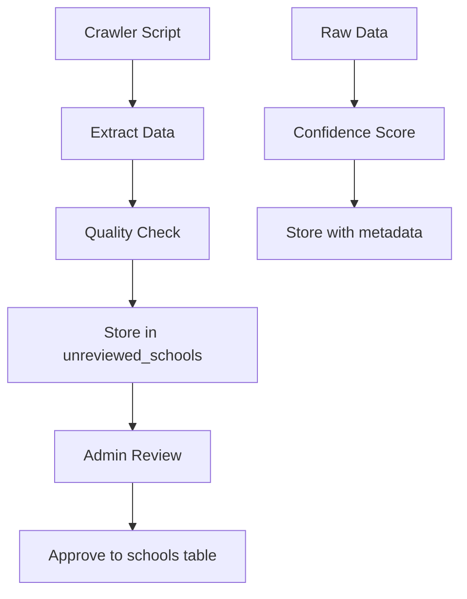

# Web Crawler Design Document

## 1. Overview

This document outlines the design and implementation of the web crawler system for the AI School Recommendation App. The crawler is specifically designed to collect university and program data from educational websites, with a focus on QS ranking data and academic institutional information.

## 2. Core Objectives

- **Educational Data Collection**: Extract university and program information from academic websites
- **QS Ranking Integration**: Specialized support for QS World University Rankings data
- **Supabase Integration**: Store data in unreviewed tables for admin review and approval
- **Polite Crawling**: Respect robots.txt and implement conservative rate limiting
- **Data Quality**: Advanced data extraction and confidence scoring
- **Monitoring**: Comprehensive logging and job tracking

## 3. Architecture Design

### 3.1 High-Level Architecture

```
┌─────────────────┐    ┌─────────────────┐    ┌─────────────────┐
│   Config &      │    │  HTTP Client    │    │  Data Extractors│
│   Settings      │    │                 │    │                 │
│ - Rate Limits   │───▶│ - Request Pool  │───▶│ - School Data   │
│ - Target URLs   │    │ - Rate Limiter  │    │ - Program Data  │
│ - Selectors     │    │ - Retry Logic   │    │ - QS Rankings   │
└─────────────────┘    └─────────────────┘    └─────────────────┘
         │                       │                       │
         ▼                       ▼                       ▼
┌─────────────────┐    ┌─────────────────┐    ┌─────────────────┐
│   Base Crawler  │    │   Specialized   │    │   Supabase      │
│                 │    │   Crawlers      │    │   Manager       │
│ - Lifecycle     │    │ - University    │    │ - Job Tracking  │
│ - Statistics    │    │ - Program       │    │ - Data Storage  │
│ - URL Tracking  │    │ - QS Rankings   │    │ - RLS Bypass    │
└─────────────────┘    └─────────────────┘    └─────────────────┘
```

### 3.2 Component Breakdown

#### Configuration System
- **CrawlerSettings**: Central configuration with environment variable support
- **Target Lists**: Priority universities and target programs
- **Rate Limiting**: Conservative delays (5s default) for polite crawling
- **Selectors**: CSS selectors for data extraction

#### HTTP Client
- **httpx-based**: Async HTTP client with modern features
- **Rate Limiting**: Built-in request throttling
- **Retry Logic**: Exponential backoff for failed requests
- **User Agent Rotation**: Multiple realistic user agents

#### Data Extractors
- **SchoolExtractor**: University information extraction
- **ProgramExtractor**: Academic program data extraction
- **Confidence Scoring**: Data quality assessment
- **Raw Data Preservation**: Store original HTML snippets for debugging

## 4. Technical Specifications

### 4.1 Technology Stack

- **Language**: Python 3.11+
- **HTTP Client**: `httpx` (async/sync support)
- **HTML Parsing**: `beautifulsoup4` with `lxml` parser
- **Data Processing**: `pandas` for data manipulation
- **Database**: `supabase` Python client
- **Configuration**: Environment variables with `python-dotenv`
- **Logging**: `loguru` for structured logging with emojis

### 4.2 Dependencies

```python
# HTTP Client and Web Scraping
requests>=2.31.0
httpx>=0.25.0
beautifulsoup4>=4.12.0
lxml>=4.9.0

# Data Processing
pandas>=2.0.0
pydantic>=2.0.0

# Logging and Utilities
loguru>=0.7.0
aiofiles>=23.0.0

# Database
supabase>=2.0.0
```

### 4.3 File Structure

```
crawler/
├── __init__.py
├── README.md                          # Usage guide and setup instructions
├── config/
│   ├── __init__.py
│   └── settings.py                    # Central configuration class
├── core/
│   ├── __init__.py
│   ├── base_crawler.py               # Core crawler functionality
│   └── http_client.py                # HTTP client with rate limiting
├── extractors/
│   ├── __init__.py
│   ├── school_extractor.py           # University data extraction
│   └── program_extractor.py          # Program data extraction
├── storage/
│   ├── __init__.py
│   └── supabase_manager.py           # Database operations
├── scripts/
│   ├── __init__.py
│   ├── crawl_universities.py         # Main university crawler
│   ├── crawl_programs.py             # Program crawler
│   ├── crawl_wikipedia_universities.py # Wikipedia data source
│   ├── ensure_qs_top200.py           # QS ranking data
│   ├── check_website_accessibility.py # Accessibility checker
│   └── test_single_website.py        # Single site testing
├── tests/
│   ├── __init__.py
│   ├── test_supabase_integration.py  # Database tests
│   ├── test_university_crawler.py    # University crawler tests
│   └── test_program_crawler.py       # Program crawler tests
└── utils/
    └── __init__.py
```

## 5. Configuration System

### 5.1 Configuration Schema

```python
class CrawlerSettings:
    """Main crawler configuration class"""
    
    # Basic Settings
    USER_AGENT = 'AcademicCrawler/1.0 (Educational Research)'
    MAX_RETRIES = 3
    
    # Rate Limiting (Conservative for Polite Crawling)
    DELAY_BETWEEN_REQUESTS = 5.0      # 5 second delay
    MAX_CONCURRENT_REQUESTS = 1        # Single-threaded
    REQUEST_TIMEOUT = 60               # 60 second timeout
    
    # Supabase Configuration
    SUPABASE_URL = os.getenv('NEXT_PUBLIC_SUPABASE_URL')
    SUPABASE_KEY = os.getenv('NEXT_PUBLIC_SUPABASE_ANON_KEY')
    
    # Target Universities (Priority List)
    PRIORITY_UNIVERSITIES = [
        "mit.edu", "stanford.edu", "berkeley.edu", "harvard.edu",
        "ox.ac.uk", "cam.ac.uk", "imperial.ac.uk", "ucl.ac.uk",
        "ethz.ch", "tum.de", "tudelft.nl",
        "nus.edu.sg", "tsinghua.edu.cn", "u-tokyo.ac.jp", "kaist.ac.kr"
    ]
    
    # Data Extraction Selectors
    UNIVERSITY_SELECTORS = {
        'name': ['h1.university-name', '.institution-title', 'h1'],
        'location': ['.location', '.address', '.city', '.country'],
        'founding_year': ['.founded', '.established', '.year-founded'],
        'website': ['a[href*="edu"]', 'a[href*="ac.uk"]']
    }
    
    PROGRAM_SELECTORS = {
        'name': ['.program-title', '.degree-name', 'h1.program-name'],
        'degree': ['.degree-type', '.program-level'],
        'duration': ['.duration', '.length', '.time-to-complete'],
        'tuition': ['.tuition', '.fees', '.cost', '.price']
    }
```

### 5.2 Environment Configuration

```bash
# .env file (root directory)
NEXT_PUBLIC_SUPABASE_URL=your_supabase_url
NEXT_PUBLIC_SUPABASE_ANON_KEY=your_supabase_anon_key
SUPABASE_SERVICE_ROLE_KEY=your_service_role_key

# Optional overrides
CRAWLER_USER_AGENT="AcademicCrawler/1.0"
CRAWLER_DELAY=5.0
CRAWLER_MAX_RETRIES=3
CRAWLER_TIMEOUT=60
```

## 6. Core Classes and Interfaces

### 6.1 BaseCrawler

```python
class BaseCrawler:
    """Base crawler class with core functionality"""
    
    def __init__(self):
        self.is_running = False
        self.crawled_count = 0
        self.failed_count = 0
        self.start_time = None
        self.visited_urls = set()  # Simple in-memory tracking
    
    def start(self):
        """Start the crawler"""
        self.is_running = True
        self.start_time = time.time()
        
    def stop(self):
        """Stop the crawler"""
        self.is_running = False
        
    def crawl_url(self, url: str) -> Optional[Dict[str, Any]]:
        """Crawl a single URL"""
        # Implementation with error handling
        
    def crawl_urls(self, urls: List[str]) -> List[Dict[str, Any]]:
        """Crawl multiple URLs"""
        # Batch processing with progress tracking
        
    def get_stats(self) -> Dict[str, Any]:
        """Get current crawling statistics"""
        # Return comprehensive stats including success rate
```

### 6.2 HTTPClient

```python
class HTTPClient:
    """HTTP client with rate limiting and retry logic"""
    
    def __init__(self):
        self.session = None
        self.last_request_time = 0
        self.request_count = 0
        self.user_agents = [...]  # Multiple realistic user agents
    
    def create_session(self):
        """Create HTTP session with proper headers"""
        self.session = httpx.Client(
            headers=headers,
            timeout=settings.REQUEST_TIMEOUT,
            follow_redirects=True,
            max_redirects=5
        )
    
    def _rate_limit(self):
        """Implement rate limiting between requests"""
        # Sleep if needed to maintain delay
        
    def get_page(self, url: str, retries: int = None) -> Optional[Dict[str, Any]]:
        """Get page content with rate limiting and retries"""
        # Returns dict with url, status_code, content, headers, timestamp
        
    def check_robots_txt(self, base_url: str) -> Optional[str]:
        """Check robots.txt file for crawling rules"""
        # Fetch and return robots.txt content
```

### 6.3 Data Extractors

```python
class SchoolExtractor:
    """Extracts school data from HTML content"""
    
    def extract_school_data(self, html_content: str, source_url: str) -> Dict[str, Any]:
        """Extract school data from HTML content"""
        return {
            'name': self._extract_name(soup),
            'location': self._extract_location(soup),
            'website': self._extract_website(soup, source_url),
            'founding_year': self._extract_founding_year(soup),
            'description': self._extract_description(soup),
            'confidence_score': self._calculate_confidence(school_data),
            'raw_data': self._extract_raw_data(soup)
        }

class ProgramExtractor:
    """Extracts program data from HTML content"""
    
    def extract_program_data(self, html_content: str, source_url: str, school_name: str) -> Dict[str, Any]:
        """Extract program data from HTML content"""
        return {
            'name': self._extract_name(soup),
            'degree': self._extract_degree(soup),
            'duration_years': self._extract_duration(soup),
            'total_tuition': self._extract_tuition(soup),
            'is_stem': self._extract_is_stem(soup),
            'delivery_method': self._extract_delivery_method(soup),
            'confidence_score': self._calculate_confidence(program_data)
        }
```

### 6.4 Supabase Manager

```python
class SupabaseManager:
    """Manages data storage to Supabase using PostgREST endpoints"""
    
    def __init__(self):
        # Setup with service role key for RLS bypass
        self.headers = {
            "apikey": self.supabase_key,
            "Authorization": f"Bearer {self.supabase_key}",
            "Content-Type": "application/json"
        }
    
    async def store_unreviewed_school(self, school_data: Dict[str, Any]) -> Optional[str]:
        """Store school data in unreviewed_schools table"""
        # Insert with QS ranking normalization
        
    async def enrich_or_insert_unreviewed_school(self, data: Dict[str, Any]) -> Tuple[Optional[str], str]:
        """Insert new or enrich existing school record"""
        # Returns (id, action) where action is "inserted", "enriched", or "skipped"
        
    async def create_crawler_job(self, job_name: str, metadata: Dict[str, Any]) -> Optional[str]:
        """Create crawler job for tracking"""
        
    async def log_crawler_message(self, job_id: str, level: str, message: str):
        """Log crawler messages to database"""
```

## 7. Data Extraction Strategies

### 7.1 School Data Extraction

The `SchoolExtractor` implements a multi-layered approach:

1. **Primary Selectors**: Try configured CSS selectors for each field
2. **Fallback Methods**: Use pattern matching and heuristics
3. **Meta Data**: Extract Open Graph, JSON-LD, and meta tags
4. **Confidence Scoring**: Calculate data quality score based on completeness

```python
def _extract_name(self, soup: BeautifulSoup) -> Optional[str]:
    # Try configured selectors first
    for selector in self.selectors['name']:
        element = soup.select_one(selector)
        if element and element.get_text(strip=True):
            return element.get_text(strip=True)
    
    # Fallback to title tag with cleaning
    title = soup.find('title')
    if title:
        clean_title = re.sub(r'\s*[-|]\s*(University|College).*$', '', title.text)
        return clean_title
```

### 7.2 QS Rankings Data

Specialized extraction for QS World University Rankings:

1. **Direct API Access**: Fetch JSON data from QS endpoints
2. **Discovery Mode**: Find API endpoints in HTML and JavaScript
3. **Ranking Normalization**: Handle various ranking formats (`=9`, `1201-1400`, `1001+`)

```python
def _normalize_qs_ranking(self, val: Any) -> Tuple[Optional[str], Optional[int], Optional[int]]:
    """
    Normalize QS ranking formats:
    - '=9' → display='=9', min=9, max=9
    - '1201-1400' → display='1201-1400', min=1201, max=1400  
    - '1001+' → display='1001+', min=1001, max=None
    """
```

### 7.3 Program Data Extraction

Program extraction focuses on academic program details:

- **Degree Types**: Extract and normalize degree levels (Master's, PhD, etc.)
- **STEM Classification**: Automatic detection based on keywords
- **Financial Information**: Parse tuition with currency detection
- **Duration Parsing**: Convert various time formats to years

```python
def _extract_is_stem(self, soup: BeautifulSoup) -> Optional[bool]:
    text = soup.get_text().lower()
    stem_keywords = [
        'computer science', 'data science', 'artificial intelligence',
        'machine learning', 'engineering', 'mathematics'
    ]
    return any(keyword in text for keyword in stem_keywords)
```

## 8. Database Storage

### 8.1 Unreviewed Data Tables

All crawled data is stored in `unreviewed_*` tables for admin review:

- **unreviewed_schools**: University data pending approval
- **unreviewed_programs**: Program data pending approval
- **crawler_jobs**: Job tracking and metadata
- **crawler_logs**: Detailed logging for debugging

### 8.2 Data Flow



### 8.3 Quality Assurance

```python
def _calculate_confidence(self, data: Dict[str, Any]) -> float:
    """Calculate confidence score for extracted data"""
    score = 0.0
    weights = {
        'name': 0.3,           # Most important
        'location': 0.2,
        'website': 0.2,
        'founding_year': 0.1,
        'description': 0.2
    }
    
    for field, weight in weights.items():
        if data.get(field):
            score += weight
    
    return round(score, 2)
```

## 9. Error Handling and Logging

### 9.1 Comprehensive Error Handling

- **Network Errors**: Connection timeouts, HTTP errors with retry logic
- **Rate Limiting**: 429/503 responses with exponential backoff
- **Data Validation**: Field validation with confidence scoring
- **Database Errors**: Supabase connection and storage issues

### 9.2 Retry Strategy Implementation

```python
def get_page(self, url: str, retries: int = None) -> Optional[Dict[str, Any]]:
    for attempt in range(retries + 1):
        try:
            # Rate limiting first
            self._rate_limit()
            
            response = self.session.get(url)
            
            if response.status_code == 200:
                return {
                    'url': url,
                    'status_code': response.status_code,
                    'content': response.text,
                    'headers': dict(response.headers),
                    'timestamp': time.time()
                }
            elif response.status_code in [429, 503]:
                # Exponential backoff for rate limiting
                wait_time = (2 ** attempt) * 5
                time.sleep(wait_time)
                continue
                
        except httpx.TimeoutException:
            if attempt < retries:
                time.sleep(settings.RETRY_DELAY)
                continue
            return None
```

### 9.3 Emoji-Enhanced Logging

```python
# Configure loguru with emojis for better readability
logger.add(
    settings.LOG_FILE,
    rotation="1 day",
    retention="30 days",
    level=settings.LOG_LEVEL,
    format="{time:YYYY-MM-DD HH:mm:ss} | {level} | {message}"
)

# Usage examples:
logger.info("🚀 Starting crawler...")
logger.info("✅ Successfully crawled: {url}")
logger.warning("⚠️ Rate limited, waiting...")
logger.error("❌ Failed to fetch: {url}")
```

### 9.4 Database Logging

All crawler activities are logged to both files and database:

```python
async def log_crawler_message(self, job_id: str, level: str, message: str):
    """Log message to crawler_logs table"""
    log_data = {
        "job_id": job_id,
        "level": level.upper(),
        "message": message,
        "context": context or {}
    }
    # Store in Supabase for admin monitoring
```

## 10. Performance Optimization

### 10.1 Conservative Rate Limiting

The crawler prioritizes politeness over speed:

- **5-second delays** between requests (configurable)
- **Single-threaded** operation to avoid overwhelming servers
- **60-second timeouts** for patient waiting
- **In-memory URL tracking** to avoid duplicates

### 10.2 Efficient Data Processing

- **Confidence scoring** to prioritize high-quality data
- **Raw data preservation** for debugging and reprocessing
- **Async database operations** for non-blocking storage
- **Selective enrichment** to update only missing fields

```python
async def enrich_or_insert_unreviewed_school(self, data: Dict[str, Any]) -> Tuple[str, str]:
    """Insert new or enrich existing school record"""
    existing = await self.get_unreviewed_school_by_match(
        website_url=data.get('website_url'),
        name=data.get('name')
    )
    
    if existing:
        # Only fill empty fields, don't overwrite existing data
        patch = {}
        for field in candidate_fields:
            if self._is_empty_value(existing.get(field)) and data.get(field):
                patch[field] = data[field]
        
        if patch:
            return await self.patch_unreviewed_school(existing['id'], patch)
    else:
        # Insert new record
        return await self.store_unreviewed_school(data)
```

## 11. Testing Strategy

### 11.1 Website Accessibility Testing

Pre-crawling verification ensures target sites are accessible:

```bash
# Check all target websites
python crawler/scripts/check_website_accessibility.py

# Test a single website
python crawler/scripts/test_single_website.py mit.edu
```

**Accessibility Report includes:**
- Response times and HTTP status codes
- Data quality scores for extracted information
- Detection of anti-bot measures (Cloudflare, CAPTCHAs)
- Available program links

### 11.2 Integration Testing

```bash
# Test Supabase integration and data extractors
python -m unittest crawler/tests/test_supabase_integration.py

# Test university data extraction
python -m unittest crawler/tests/test_university_crawler.py

# Test program data extraction
python -m unittest crawler/tests/test_program_crawler.py
```

### 11.3 Real-World Testing

- **QS Rankings**: Direct API testing with actual QS endpoints
- **University Websites**: Testing against real institutional pages
- **Data Quality**: Validation of extracted data completeness
- **Database Storage**: End-to-end storage verification

### 11.4 Troubleshooting Guide

**Common Issues:**
1. **Supabase Connection Failed** → Check environment variables
2. **Website Blocked** → Increase delays, check robots.txt
3. **Data Extraction Poor** → Review CSS selectors, check site changes

## 12. Security Considerations

### 12.1 Database Security

- **Service Role Key**: Uses Supabase service role to bypass RLS for crawler operations
- **Unreviewed Tables**: All data goes to staging tables requiring admin approval
- **Input Sanitization**: BeautifulSoup parsing prevents HTML injection
- **Environment Variables**: Sensitive credentials stored in `.env` files

### 12.2 Ethical Crawling

- **Robots.txt Compliance**: Automatic checking and respect for crawling policies
- **Conservative Rate Limiting**: 5-second delays prevent server overload
- **Educational Purpose**: Clear user agent identification for research purposes
- **Public Data Only**: Focus on publicly available institutional information

```python
def check_robots_txt(self, base_url: str) -> Optional[str]:
    """Check robots.txt file for crawling rules"""
    robots_url = f"https://{base_domain}/robots.txt"
    response = self.session.get(robots_url, timeout=10)
    if response.status_code == 200:
        return response.text
```

### 12.3 Data Protection

- **GDPR Compliance**: Only collect publicly available educational data
- **Data Minimization**: Extract only necessary academic information
- **Audit Trail**: Complete logging for transparency and debugging

## 13. Deployment and Usage

### 13.1 Setup and Installation

```bash
# 1. Install dependencies
pip install -r requirements.txt

# 2. Configure environment variables
cp env.local.example .env
# Edit .env with your Supabase credentials

# 3. Test accessibility first
python crawler/scripts/check_website_accessibility.py

# 4. Run the main crawler
python crawler/scripts/crawl_universities.py --limit 20
```

### 13.2 Monitoring and Observability

- **Real-time logging** with emoji indicators for easy status monitoring
- **Database job tracking** in `crawler_jobs` table
- **Detailed error logging** to `crawler_logs` table
- **Statistics tracking** with success rates and timing metrics

```bash
# Monitor logs in real-time
tail -f logs/crawler.log

# Check job status in Supabase admin dashboard
# Review unreviewed_schools table for data quality
```

### 13.3 Script Options

```bash
# University crawler with QS ranking data
python crawler/scripts/crawl_universities.py \
  --limit 50 \
  --qs-main-url "https://www.qschina.cn/sites/default/files/qs-rankings-data/..." \
  --qs-indicators-url "https://www.qschina.cn/sites/default/files/qs-rankings-data/..._indicators.txt"

# Program crawler for specific universities
python crawler/scripts/crawl_programs.py --school "MIT"

# Wikipedia data source
python crawler/scripts/crawl_wikipedia_universities.py
```

## 14. Integration with Main Application

### 14.1 Data Review Workflow

1. **Crawler** stores data in `unreviewed_*` tables
2. **Admin dashboard** displays pending data for review
3. **Admin approval** moves data to main `schools` and `programs` tables
4. **Public API** serves approved data to users

### 14.2 Quality Control

- **Confidence scoring** helps admins prioritize review items
- **Raw data preservation** enables reprocessing and debugging
- **Duplicate detection** prevents redundant entries
- **Field enrichment** fills missing data without overwriting existing

## 15. Conclusion

This web crawler represents a production-ready system specifically designed for educational data collection. Key achievements include:

- **Educational Focus**: Specialized for university and program data extraction
- **QS Integration**: Direct support for QS World University Rankings
- **Quality Assurance**: Confidence scoring and data validation
- **Ethical Crawling**: Conservative rate limiting and robots.txt compliance
- **Database Integration**: Seamless Supabase storage with admin workflow
- **Monitoring**: Comprehensive logging and job tracking

The crawler successfully balances data collection needs with ethical considerations, providing a reliable foundation for the AI School Recommendation App's data requirements.
